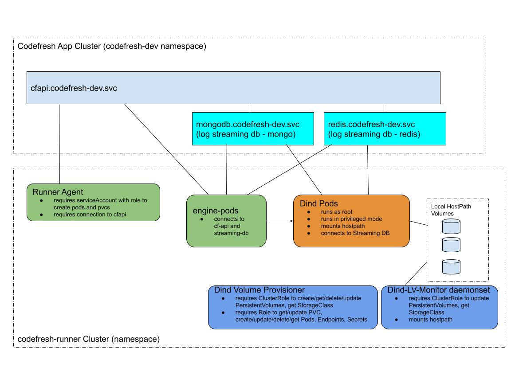

# Codefresh Runner for Openshift

permissions and connectivity we need for pods:  


## Permissions
Example of creation codefresh-runner project and RBAC rules (by openshift admin):  
- [Project Creation Example](os-project)
- [RBAC Objects for codefresh runner](os-project/k8s-admin-obj)

We should be able to mount hostpath and run as root in privleged mode  
Test it by submitting [dind-hostpath-test.yaml](dind-hostpath-test.yaml):  
```
# Set your nodeSelector or Afffinity and:
oc create dind-hostpath-test.yaml
```
Now ensure that pod is running and dockerd is accessible. Send to Codefresh Support these commands: 
```
oc describe pod dind-hostpath-1 -oyaml
oc exec -it dind-hostpath-1 docker info
oc logs dind-hostpath-1

## Check docker login/run/pull/push, for example:
oc exec -it dind-hostpath-1 bash

   docker login artifactory.six-group.net
   docker run -it artifactory.six-group.net/ubuntu bash
```
## Connectivity
runner, engine and dind pods should be able to connect to the services on Codefresh-App namespace. There are two ways:
- if codefresh-runner is in same cluster as Codefresh-App (coderesh-dev in Six), you can permit network access between these namespaces

- Create Egress from codefresh-runner namespace to the ingresses of codefresh-dev namespaces

## Codefresh Runner Configuration

### Prerequisites:
- Openshift project setup - see above
- set customKubernetesCluster featureFlag
- [codefresh cli](https://codefresh-io.github.io/cli/)
- push images to the private registry:

```
kcfi images push -c ../config.yaml codefresh/dind:18.09.5-v24-sp codefresh/venona:1.4.21 codefresh/dind-volume-provisioner:v24 codefresh/dind-volume-utils:v5
```
### Install Codefresh runner
Edit [runner-values.yaml](runner-values.yaml) , set CodefreshHost, Token, Context, Namespace and other parameters  

Run:  
```
codefresh runner init --values runner-values.yaml
```

### Example of running pods on codefresh-runner namespace:  
```
oc get pods -n codefresh-runner 
NAME                                              READY     STATUS        RESTARTS   AGE
dind-5f5093f70e33a81866979e5e                     1/1       Running       0          15m
engine-5f5093f70e33a81866979e5e                   1/1       Running       0          15m
dind-5f5093f70e33a81866979e8d                     1/1       Running       0          10m
engine-5f5093f70e33a81866979e8d                   1/1       Running       0          10m

dind-lv-monitor-runner-c7pqb                      1/1       Running       0          1d
dind-lv-monitor-runner-tf8kz                      1/1       Running       0          1d
dind-volume-provisioner-runner-6cdccbb794-24t4l   1/1       Running       0          1d
runner-84c99c4dc9-h62jh                           1/1       Running       0          1d

```